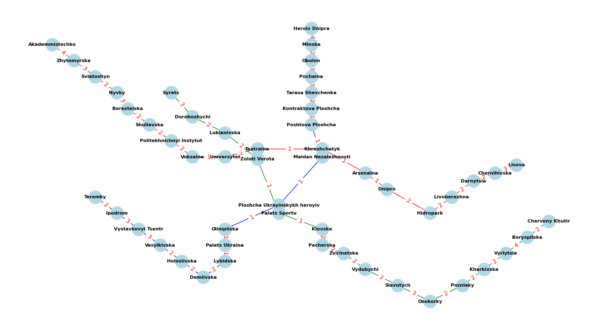

# goit-algo-hw-06

# Home work | Module 6 | Graphs

## Task 1

Для вирішення завдання було обрано репрезентацію сполучень ліній метрополітену міста Києва. Побудовано зважений граф, величини для кожного ребра представлені у вигляді імовірної відстані між станціями.

### Kiev's Metropolitan Network Graph

Проведено аналіз графа, а саме наступні показники:

1. **Number of nodes (кількість вузлів)**:

Вказує на загальну кількість станцій метро в мережі. Кількість вузлів дорівнює 52, що означає, що у графі є 52 станції метро.

2. **Number of edges (кількість ребер)**:

Вказує на загальну кількість з'єднань між станціями метро. Кількість ребер дорівнює 52, що означає, що у графі є 52 з'єднання між станціями.

3. **Степінь вузла (node degree)**:

Степінь вузла (node degree) визначається як кількість ребер, що виходять з цього вузла. Наприклад, якщо вузол має степінь 2, це означає, що він з'єднаний з двома іншими вузлами.

                        Station  Degree
0                 Akademmistechko       1
1                     Zhytomyrska       2
2                      Sviatoshyn       2
3                           Nyvky       2
4                     Beresteiska       2
5                      Shuliavska       2
6        Politekhnichnyi Instytut       2
7                        Vokzalna       2
8                     Universytet       2
9                       Teatralna       3
10                   Khreshchatyk       3
11                      Arsenalna       2
12                         Dnipro       2
13                      Hidropark       2
14                   Livoberezhna       2
15                      Darnytsia       2
16                   Chernihivska       2
17                         Lisova       1
18                  Heroiv Dnipra       1
19                         Minska       2
20                         Obolon       2
21                       Pochaina       2
22              Tarasa Shevchenka       2
23           Kontraktova Ploshcha       2
24              Poshtova Ploshcha       2
25           Maidan Nezalezhnosti       3
26  Ploshcha Ukrayinskykh heroyiv       3
27                     Olimpiiska       2
28                 Palats Ukraina       2
29                       Lybidska       2
30                      Demiivska       2
31                    Holosiivska       2
32                    Vasylkivska       2
33             Vystavkovyi Tsentr       2
34                        Ipodrom       2
35                        Teremky       1
36                         Syrets       1
37                   Dorohozhychi       2
38                    Lukianivska       2
39                  Zoloti Vorota       3
40                  Palats Sportu       3
41                        Klovska       2
42                      Pecherska       2
43                    Zvirinetska       2
44                      Vydubychi       2
45                      Slavutych       2
46                       Osokorky       2
47                       Pozniaky       2
48                     Kharkivska       2
49                      Vyrlytsia       2
50                    Boryspilska       2
51                Chervony Khutir       1

- *Кінцеві станції*:

Вузли зі степенем 1 є кінцевими станціями, тобто станціями, які мають лише одну суміжну станцію. Наприклад, 'Akademmistechko' та 'Chervony Khutir'.

- *Перехідні вузли*:

Вузли зі степенем 2 є звичайними проміжними станціями, які з'єднані з двома іншими станціями. Це типово для більшості станцій на прямій лінії метро. Наприклад, 'Zhytomyrska' та 'Nyvky'.

- *Станції пересадок*:

Вузли зі степенем 3 або більше є станціями пересадок, де з'єднуються більше ніж дві лінії метро. Наприклад, 'Teatralna', 'Khreshchatyk', 'Maidan Nezalezhnosti' та 'Zoloti Vorota'.

## Task 2

На практиці застосовано алгоритми DFS та BFS з наступними початковими даними:

start_station = "Akademmistechko"
end_station = "Kontraktova Ploshcha"

### Результати:

1. **DFS (пошук в глибину)**
- DFS path from Akademmistechko to Kontraktova Ploshcha: ['Akademmistechko', 'Zhytomyrska', 'Sviatoshyn', 'Nyvky', 'Beresteiska', 'Shuliavska', 'Politekhnichnyi Instytut', 'Vokzalna', 'Universytet', 'Teatralna', 'Khreshchatyk', 'Maidan Nezalezhnosti', 'Poshtova Ploshcha', 'Kontraktova Ploshcha']
- DFS distance: 24
2. **BFS (пошук в ширину)**
- BFS path from Akademmistechko to Kontraktova Ploshcha: ['Akademmistechko', 'Zhytomyrska', 'Sviatoshyn', 'Nyvky', 'Beresteiska', 'Shuliavska', 'Politekhnichnyi Instytut', 'Vokzalna', 'Universytet', 'Teatralna', 'Khreshchatyk', 'Maidan Nezalezhnosti', 'Poshtova Ploshcha', 'Kontraktova Ploshcha']
- BFS distance: 24

### Висновки:

**DFS (пошук в глибину)** та **BFS (пошук в ширину)** зазвичай дають різні результати, оскільки вони використовують різні стратегії для пошуку шляхів у графі. Однак у випадку графу ліній метро міста Києва обидва алгоритми дають однаковий результат через наступні причини:

Структура графу: Граф, який представляє київське метро, має досить лінійну структуру. Станції йдуть одна за одною у певному порядку, і обидва алгоритми можуть проходити ці станції у тому ж порядку.

Послідовність вершин: У графі немає складних розгалужень або альтернативних шляхів між "Akademmistechko" та "Kontraktova Ploshcha". Тому обидва алгоритми проходять ті ж самі вершини в тому ж порядку.

## Task 3

 Алгоритм Дейкстри дозволяє знайти найкоротші шляхи між вузлами в графі з вагами. Це корисно для визначення мінімальних відстаней в мережах з нерівномірними вагами ребер.

 Найкоротші шляхи між усіма вузлами графа знайдені за допомогою алгоритму Дейкстри та збережені у файлі **dijkstra_results.md** у вигляді таблиці. Це дозволяє визначити мінімальні відстані в мережах з нерівномірними вагами ребер.

 Нижче для прикладу частина таблиці.

 |                               |   Akademmistechko |   Zhytomyrska |   Sviatoshyn |   Nyvky |   Beresteiska |   Shuliavska |   Politekhnichnyi Instytut |   Vokzalna |   Universytet |   Teatralna |   Khreshchatyk |   Arsenalna |   Dnipro |   Hidropark |   Livoberezhna |   Darnytsia |   Chernihivska |   Lisova |   Heroiv Dnipra |   Minska |   Obolon |   Pochaina |   Tarasa Shevchenka |   Kontraktova Ploshcha |   Poshtova Ploshcha |   Maidan Nezalezhnosti |   Ploshcha Ukrayinskykh heroyiv |   Olimpiiska |   Palats Ukraina |   Lybidska |   Demiivska |   Holosiivska |   Vasylkivska |   Vystavkovyi Tsentr |   Ipodrom |   Teremky |   Syrets |   Dorohozhychi |   Lukianivska |   Zoloti Vorota |   Palats Sportu |   Klovska |   Pecherska |   Zvirinetska |   Vydubychi |   Slavutych |   Osokorky |   Pozniaky |   Kharkivska |   Vyrlytsia |   Boryspilska |   Chervony Khutir |
|:------------------------------|------------------:|--------------:|-------------:|--------:|--------------:|-------------:|---------------------------:|-----------:|--------------:|------------:|---------------:|------------:|---------:|------------:|---------------:|------------:|---------------:|---------:|----------------:|---------:|---------:|-----------:|--------------------:|-----------------------:|--------------------:|-----------------------:|--------------------------------:|-------------:|-----------------:|-----------:|------------:|--------------:|--------------:|---------------------:|----------:|----------:|---------:|---------------:|--------------:|----------------:|----------------:|----------:|------------:|--------------:|------------:|------------:|-----------:|-----------:|-------------:|------------:|--------------:|------------------:|
| Akademmistechko               |                 0 |             4 |            7 |       9 |            12 |           14 |                         16 |         18 |            19 |          20 |             21 |          22 |       23 |          25 |             27 |          29 |             31 |       34 |              38 |       34 |       32 |         29 |                  26 |                     24 |                  23 |                     22 |                              23 |           24 |               25 |         26 |          28 |            30 |            32 |                   35 |        38 |        40 |       28 |             25 |            23 |              21 |              22 |        23 |          25 |            27 |          29 |          31 |         34 |         36 |           38 |          40 |            44 |                46 |
| Zhytomyrska                   |                 4 |             0 |            3 |       5 |             8 |           10 |                         12 |         14 |            15 |          16 |             17 |          18 |       19 |          21 |             23 |          25 |             27 |       30 |              34 |       30 |       28 |         25 |                  22 |                     20 |                  19 |                     18 |                              19 |           20 |               21 |         22 |          24 |            26 |            28 |                   31 |        34 |        36 |       24 |             21 |            19 |              17 |              18 |        19 |          21 |            23 |          25 |          27 |         30 |         32 |           34 |          36 |            40 |                42 |
| Sviatoshyn                    |                 7 |             3 |            0 |       2 |             5 |            7 |                          9 |         11 |            12 |          13 |             14 |          15 |       16 |          18 |             20 |          22 |             24 |       27 |              31 |       27 |       25 |         22 |                  19 |                     17 |                  16 |                     15 |                              16 |           17 |               18 |         19 |          21 |            23 |            25 |                   28 |        31 |        33 |       21 |             18 |            16 |              14 |              15 |        16 |          18 |            20 |          22 |          24 |         27 |         29 |           31 |          33 |            37 |                39 |
| Nyvky                         |                 9 |             5 |            2 |       0 |             3 |            5 |                          7 |          9 |            10 |          11 |             12 |          13 |       14 |          16 |             18 |          20 |             22 |       25 |              29 |       25 |       23 |         20 |                  17 |                     15 |                  14 |                     13 |                              14 |           15 |               16 |         17 |          19 |            21 |            23 |                   26 |        29 |        31 |       19 |             16 |            14 |              12 |              13 |        14 |          16 |            18 |          20 |          22 |         25 |         27 |           29 |          31 |            35 |                37 |
| Beresteiska                   |                12 |             8 |            5 |       3 |             0 |            2 |                          4 |          6 |             7 |           8 |              9 |          10 |       11 |          13 |             15 |          17 |             19 |       22 |              26 |       22 |       20 |         17 |                  14 |                     12 |                  11 |                     10 |                              11 |           12 |               13 |         14 |          16 |            18 |            20 |                   23 |        26 |        28 |       16 |             13 |            11 |               9 |              10 |        11 |          13 |            15 |          17 |          19 |         22 |         24 |           26 |          28 |            32 |                34 |